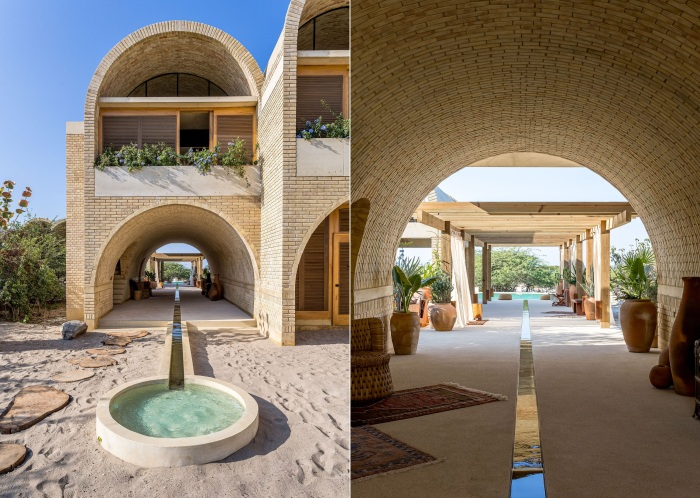

# A colorful boutique hotel opened in Mexico, reminiscent of the arched dwellings of the ancient Incas

A new boutique hotel has opened near a port city in Mexico that attracts visitors with arched rooms created by local craftsmen using ancient construction techniques and in keeping with the traditions of arts and crafts. Casona Sforza combines hospitality, comfort and elegance in tandem with a tranquil setting, where the colorful design of the arched silhouettes of the hotel complex clearly recalls the dwellings of ancient civilizations, harmoniously integrated into the picturesque Pacific coastline.

- Located in the serene landscape of La Barra de Colotepec, not far from Puerto Escondido, Mexico, the boutique hotel Casona Sforza has become a new landmark that attracts tourists who prefer to stay in unusual hotels. Bohemian aesthetics, unmatched views of the golden sands of the Pacific coast, unique architecture, inspired by folk traditions and modern luxury, exclusivity and privacy - all this will make your vacation truly unforgettable.

According to the Novate.ru editorial office, hotelier Ezequiel Ayarza Sforza and the famous architect Alberto Calacu took several years of hard research and development to make everything come to life. Despite the lengthy creative design process, the inspired developers managed to create an object that subtly emphasizes the connection of times, the acceptance and redefinition of values, craftsmanship and care for the environment, giving guests a unique opportunity to experience the essence of natural beauty, devoid of artificiality.

- The most spectacular introduction, of course, was the vaulted design of the hotel rooms. As you know, arches have many advantages, from aesthetics to more practical properties. They increase the seismic resistance of structures, help to improve air circulation, and their elegant curves attract not admiring glances.

